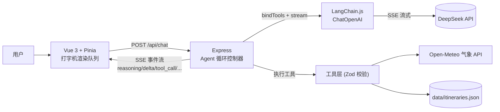
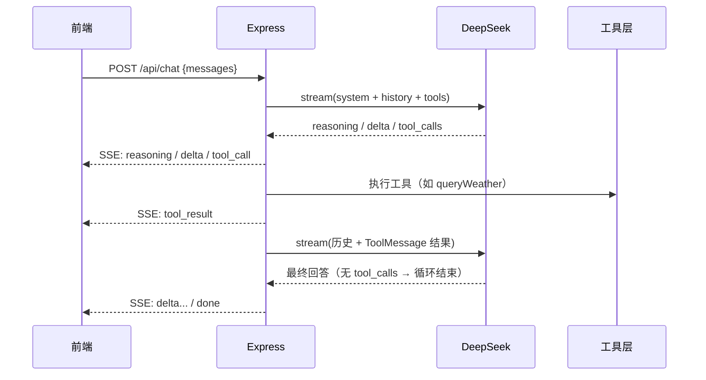

# Travel AI · 旅行规划 Agent 全栈应用

基于 LLM 的旅行规划助手：模型可**自主决策**调用工具（实时天气 / 景点检索 / 预算计算 / 行程持久化），经多步推理生成结构化行程建议；前端完整呈现思考过程与工具调用轨迹，全链路 SSE 流式输出。

> 核心关键词：**Tool Calling · ReAct Agent 循环 · SSE 流式全链路优化 · Agent 过程可视化**

<!-- 截图：将演示截图放到 docs/ 目录后取消注释，建议一张完整对话图（含思考过程 + 工具轨迹 + 流式正文）

-->

## 核心特性

- **ReAct Agent 循环**：流式生成 → 解析 `tool_calls` → 执行工具 → `ToolMessage` 回填 → 继续生成，最多 6 步防死循环，工具异常转译为文本回填支持模型自我纠错
- **真实数据工具**：天气接入 [Open-Meteo](https://open-meteo.com/) 免费气象 API（城市定位 + 实时/当日预报 + WMO 天气码中文化，8s 超时熔断）；预算为真实计算逻辑；行程持久化到本地 JSON
- **SSE 流式全链路优化**：解决压缩块缓冲、代理缓冲等三级缓冲问题，首字延迟从 11s 降至 2s 内
- **客户端打字机引擎**：事件入队 + 定时器匀速渲染（约 125 字/秒），上游突发吐字下体验一致
- **Agent 过程可视化**：思考过程（reasoning）流式展示；工具调用轨迹条目呈现「调用中 → 完成」状态，入参与执行结果可展开查看
- **mock 降级**：未配置 API Key 自动进入 mock 流式模式，前后端可完全并行开发

## 架构总览



## Agent 工作流程



**SSE 事件协议**（`data: <json>\n\n`，按 `\n\n` 分帧）：

| type | 说明 | 关键字段 |
|---|---|---|
| `meta` | 模式声明 | `mode: live \| mock` |
| `reasoning` | 推理模型思考过程片段 | `content` |
| `delta` | 正文流式片段 | `content` |
| `tool_call` | Agent 发起工具调用 | `id` / `name` / `args` |
| `tool_result` | 工具执行结果 | `id` / `name` / `result`（截断至 500 字符） |
| `error` / `done` | 出错 / 结束 | `message` |

## 内置工具集

| 工具 | 功能 | 数据源 |
|---|---|---|
| `queryWeather` | 实时天气 + 当日温度区间 + 特殊天气出行提示 | **Open-Meteo 真实 API**：geocoding 中文城市定位 → forecast 实时/预报，WMO 天气码中文化，8s 超时熔断 |
| `searchAttractions` | 景点检索（门票/时长/简介） | 内置数据（可替换为任意 POI API，协议层零改动） |
| `estimateBudget` | 按档位/天数/人数计算预算明细 | 真实计算（住宿按 2 人一间拆分） |
| `saveItinerary` | 行程方案持久化并返回编号 | 本地 JSON 文件 |

工具参数均通过 **Zod schema** 校验，描述中写明调用时机约束（如"天气问题必须调用本工具，禁止凭记忆编造"）。

## 工程实践与难点攻克

- **SSE 全链路缓冲治理**：SSE 是流式协议，但任何一跳缓冲都会毁掉实时性——上游 gzip 压缩导致按压缩块缓冲、反向代理默认开启 proxy buffering。通过 `Accept-Encoding: identity`（禁上游压缩）+ `X-Accel-Buffering: no`（禁代理缓冲）逐跳治理，首字延迟 **11s → 2s 内**
- **半包与多字节字符**：SSE 分帧不保证对齐 TCP 包边界，用 `TextDecoder({stream: true})` 增量解码 + 行缓冲，正确处理跨包 JSON 与 UTF-8 多字节字符
- **长连接进程生命周期**：曾定位「LLM 不返回 tool_calls」假象——实为调试代码写盘触发 nodemon 重启杀断 SSE 连接（ignore glob 配置失效）。教训：**长连接场景下进程重启的表现是"静默无数据"而非报错**，怀疑外部服务前先审计自身进程生命周期
- **Vue 3 响应式代理引用**：流式对象 push 进响应式数组后，异步回调持有的是原始对象引用，修改绕过 Proxy 拦截导致视图不更新；统一以 `reactive()` 包装后操作代理解决
- **健壮性设计**：前端 90s 空闲超时 + `AbortController` 主动中断；后端以 `writableEnded` 区分正常结束与异常断开；Agent 步数上限 + 工具异常转译，避免死循环与异常直接透出

## 快速开始

```bash
# 前端（默认 5173 端口，/api 已代理到 3000）
npm install
npm run dev

# 后端（3000 端口）
cd server
npm install
cp .env.example .env   # 按需填入 LLM_API_KEY（DeepSeek / 其他 OpenAI 兼容服务）
npm run dev
```

未配置 `LLM_API_KEY` 时后端自动进入 mock 流式模式，无需真实 Key 即可体验完整交互。

## 目录结构

```
├── src/                        # 前端（Vue 3 + TS + Vant）
│   ├── api/chat.ts             # SSE 客户端：事件解析 / 空闲超时 / 半包处理
│   ├── stores/chat.ts          # Pinia：打字机队列 / 思考与工具轨迹状态
│   └── views/ChatView.vue      # 对话页：思考过程 / 工具轨迹 / 流式正文
└── server/                     # 后端（Express + LangChain.js）
    └── src/
        ├── controllers/chatController.js   # Agent 循环（ReAct）核心
        ├── llm/tools.js                    # 工具定义（Zod 校验）与执行
        ├── llm/model.js                    # 模型配置（OpenAI 兼容，可切换厂商）
        ├── llm/prompts.js                  # 系统提示词（含工具调用规范）
        └── llm/mockStream.js               # mock 降级流
```
